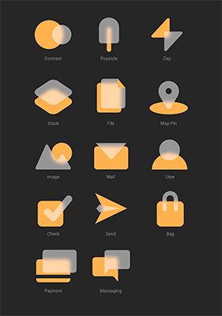
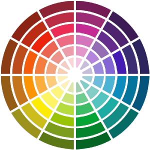
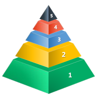

# 0️⃣ Fundamentos del Diseño de Interfaces Web

{align="right"}

En este primer tema, nos adentraremos en los pilares básicos que sustentan el diseño de interfaces web efectivas y atractivas. Comprenderemos la importancia de la comunicación visual y cómo los principios del diseño, como el balance, el contraste, la alineación y la proximidad, juegan un papel crucial en la creación de interfaces que no solo sean funcionales, sino también estéticamente agradables.

Exploraremos cómo la elección adecuada de colores y tipografías puede influir en la percepción y usabilidad de un sitio web, así como las mejores prácticas para presentar la información de manera clara y ordenada. Además, aprenderemos a definir y aplicar una guía de estilo, una herramienta esencial para mantener la coherencia visual en cualquier proyecto web.

Finalmente, nos familiarizaremos con la creación y utilización de plantillas de diseño, que nos permitirán estandarizar procesos y garantizar que las interfaces mantengan un aspecto y funcionamiento homogéneo a lo largo de todo el desarrollo. Este tema sentará las bases para el resto del curso, brindándonos los conocimientos esenciales para abordar los retos del diseño de interfaces con seguridad y creatividad.

## 0.1. La Importancia de la Comunicación Visual en el Diseño Web

El diseño de interfaces web va más allá de la simple creación de páginas estéticamente agradables; se trata de establecer una comunicación efectiva entre el usuario y el sistema. La comunicación visual es el medio por el cual los usuarios interpretan y navegan una aplicación o sitio web. Un buen diseño visual guía al usuario, facilita la interacción y mejora la experiencia general.

!!! tip "Elementos clave de la comunicación visual"

La comunicación visual es el proceso mediante el cual se transmite información e ideas a través de elementos visuales. En el contexto del diseño de interfaces web, los elementos visuales no solo decoran la página, sino que juegan un rol esencial en guiar al usuario, influir en su percepción y mejorar su experiencia. A continuación, se detallan los elementos clave de la comunicación visual y su aplicación en el diseño web.

### ✨ 0.1.1 Iconografía

{align="right"}

La iconografía se refiere al uso de iconos o símbolos gráficos para representar objetos, ideas, acciones o funciones de manera visual.

En el diseño de interfaces web, los iconos son herramientas poderosas que permiten transmitir información de forma rápida, clara y sin la necesidad de utilizar texto extenso.

Los iconos actúan como atajos visuales, mejorando la experiencia de usuario al hacer que la navegación sea más intuitiva y comprensible.

### 🎉 0.1.2 Funciones esenciales en el diseño web:

- !!! tip "Simplificación de la información"
Un icono bien diseñado puede comunicar una idea o acción en cuestión de milisegundos, lo que reduce la necesidad de textos explicativos. Esto es especialmente útil en interfaces móviles o en sitios con contenido limitado por espacio.

- !!! info "Mejora de la navegación"
Al representar acciones o funciones de manera visual, los iconos facilitan que los usuarios identifiquen rápidamente los elementos interactivos de la página, como menús, botones de acciones y enlaces.

- !!! warning "Refuerzo de la identidad visual"
El uso de iconos personalizados alineados con la identidad visual de una marca puede ayudar a crear un diseño coherente y distintivo, haciendo que la web sea más memorable.

- !!! bug "Estandarización y familiaridad"
Los iconos que representan funciones comunes (como el carrito de compras, la lupa de búsqueda, o la casa para la página de inicio) son ya entendidos de forma universal por la mayoría de los usuarios. Esto facilita la navegación y reduce la curva de aprendizaje.

!!! note "El ejemplo de DON'T WALK"
    {align="left"}

    En EEUU los semáforos no usaban iconos o símbolos para decirle al peatón cuándo podía cruzar la calle, simplemente mostraban el texto "DONT WALK" en rojo para que los peatones no cruzaban la calle o "WALK" para que la cruzaran.

### 💢 0.1.3 Tipos de iconos y usos comunes

Existen diferentes tipos de iconos en el diseño de interfaces web, cada uno con funciones y aplicaciones específicas:

🌐 `Iconos de navegación` <br>
Estos iconos permiten al usuario moverse por la interfaz. Ejemplos comunes son el menú hamburguesa (tres líneas horizontales para desplegar un menú), la flecha de regreso, o la casa que lleva a la página principal.

🏃‍♀️‍➡️ `Iconos de acción` <br>
Estos iconos indican al usuario que puede realizar una acción. Por ejemplo, el icono de lupa que permite buscar información, el carrito de compras que añade productos, o el icono de descarga.

✅ `Iconos de estado`<br>
Informan sobre el estado actual de un proceso. Por ejemplo, un check puede señalar que una tarea está completada, mientras que un reloj indica que algo está en progreso o pendiente.

🛜 `Iconos de redes sociales` <br>
Los iconos que representan plataformas como Facebook, Twitter o Instagram son elementos recurrentes en muchas webs y facilitan la vinculación de contenido con perfiles o cuentas en redes.

### 📓 0.1.4 Buenas Prácticas en el Uso de iconos

Para que los iconos en una interfaz web sean efectivos, es necesario tener en cuenta varias buenas prácticas en su diseño y aplicación

- Claridad y simplicidad: Los iconos deben ser fáciles de interpretar, incluso en tamaños pequeños. Un icono demasiado detallado puede resultar confuso. La simplicidad es clave para que el usuario comprenda rápidamente su función.

- Consistencia visual: Todos los iconos de una interfaz deben compartir un estilo coherente, en términos de líneas, grosor, tamaño y color. Esta consistencia asegura que el diseño se vea uniforme y profesional.

- Compatibilidad cultural: Algunos iconos tienen significados diferentes en distintos contextos culturales. Por ejemplo, un icono que simboliza "OK" en una cultura puede tener un significado negativo en otra. Es importante considerar las variaciones culturales si la web está dirigida a un público global.

- Compatibilidad técnica: Los iconos deben renderizarse correctamente en todos los navegadores y dispositivos. Esto incluye tanto las versiones de escritorio como las móviles. Los iconos en formato SVG (Scalable Vector Graphics) son una opción popular ya que son escalables sin perder calidad.

- Accesibilidad: Es fundamental acompañar los iconos con texto alternativo (atributo alt) o etiquetas ARIA para asegurar que los usuarios con discapacidades visuales, que utilicen lectores de pantalla, puedan entender su función.


### 🤯 0.1.5 Psicología y Simbología en la Iconografía
{align="right"}

Los iconos, al igual que otros elementos visuales, están profundamente conectados con la psicología del usuario. La interpretación de un símbolo no solo depende de su apariencia, sino también de las asociaciones que las personas tienen con él. A lo largo del tiempo, algunos iconos se han convertido en universales y sus significados son prácticamente automáticos. Por ejemplo, una papelera es reconocida a nivel global como un símbolo para eliminar o descartar contenido, mientras que una flecha hacia abajo a menudo se interpreta como una opción para descargar archivos o desplegar menús.

El uso de estos símbolos conocidos en el diseño web tiene múltiples beneficios. En primer lugar, reduce la curva de aprendizaje para los usuarios, ya que no necesitan interpretar nuevos signos o leer explicaciones detalladas para entender una acción. Este conocimiento previo hace que la interacción con la interfaz sea más intuitiva y eficiente. Además, los símbolos universales como estos fomentan la usabilidad, ya que el usuario puede anticipar la función del icono sin esfuerzo, mejorando así su experiencia en la página.

Sin embargo, el uso de iconografía también debe ir acompañado de una consideración cultural y del contexto en el que se va a aplicar. En algunos casos, un icono que es evidente para un grupo de usuarios puede no tener el mismo significado para otro grupo. Por lo tanto, es recomendable realizar pruebas de usuario para asegurarse de que los iconos sean interpretados correctamente en el público objetivo.

### 🧰 0.1.6 Herramientas y Tecnologías para la Creación de Iconos

{align="right"}

Existen varias herramientas que permiten diseñar y aplicar iconografía en el diseño web de forma eficiente:

- `Iconos prediseñados` <br>
Herramientas como **Font Awesome**, **Material Icons** o **Iconmonstr** proporcionan bibliotecas de iconos prediseñados que pueden ser fácilmente integrados en proyectos web mediante código HTML y CSS.

- `Diseño personalizado` <br>
Para un enfoque más personalizado, herramientas como **Adobe Illustrator**, **Sketch** o **Figma** permiten crear iconos vectoriales únicos que pueden alinearse perfectamente con la identidad de la marca.

- `Iconos en formato SVG` <br>
El formato **SVG** es ideal para usar en la web, ya que estos archivos son ligeros y escalables, lo que garantiza una apariencia nítida en cualquier tamaño de pantalla. Además, los iconos SVG pueden ser estilizados directamente con CSS, lo que permite cambiar colores o tamaños según sea necesario.

!!! warning "Área de recursos"
    [Font Awesome |](https://fontawesome.com)
    [Material Icons |](https://fonts.google.com/icons)
    [Iconmonstr |](https://iconmonstr.com)
    [Sketch |](https://www.sketch.com)
    [Figma](https://www.figma.com)

## 🌈 0.2 Los Colores

{align="right"}

El color es uno de los elementos más poderosos en el diseño de interfaces web, ya que tiene la capacidad de influir en la percepción, las emociones y el comportamiento de los usuarios.

Una paleta de colores bien seleccionada no solo mejora la estética de la página, sino que también facilita la navegación, refuerza la identidad de marca y establece una jerarquía visual clara.

Además, el uso adecuado del color puede mejorar la accesibilidad y la usabilidad de la interfaz, permitiendo que la información sea más comprensible y fácil de seguir. En este apartado, exploraremos la importancia de los colores en el diseño web, cómo seleccionarlos de manera efectiva y cómo aplicarlos para mejorar la experiencia del usuario.

El uso del color en el diseño de interfaces web va mucho más allá de un simple elemento decorativo. El color es una herramienta clave para transmitir sensaciones, guiar la navegación del usuario, crear contrastes que mejoren la legibilidad y, en última instancia, generar una experiencia más atractiva y funcional. La selección adecuada de una paleta de colores no solo afecta la estética de una web, sino también la forma en la que los usuarios interactúan con ella, perciben el contenido y toman decisiones.

En el diseño web, el color se emplea de diversas formas: para dar vida a los elementos visuales, generar coherencia en la identidad de marca, y destacar o agrupar información. Además, la correcta elección de colores puede impactar directamente en la accesibilidad del sitio, haciendo que este sea más inclusivo para personas con discapacidades visuales o daltonismo.

### 🗣️ 0.2.1 Psicología del Color

Uno de los aspectos más importantes del uso del color en el diseño web es su capacidad para evocar emociones y transmitir mensajes de manera implícita. La psicología del color estudia cómo los colores afectan las emociones y comportamientos humanos, algo que los diseñadores web deben tener en cuenta al seleccionar la paleta de una interfaz.

Cada color puede generar diferentes respuestas emocionales, y su elección debe alinearse con los objetivos del sitio web y la marca.

- ⭕ `Rojo`<br>
Un color asociado con la pasión, la energía y la urgencia. Suele utilizarse para crear sensación de urgencia (como en ofertas o promociones) o para llamar la atención sobre elementos importantes, aunque en exceso puede generar sensación de agresividad.

- 🔷 `Azul`<br>
Se asocia con la calma, la confianza y la profesionalidad. Es un color muy utilizado en sitios web corporativos o de servicios financieros, ya que transmite estabilidad y seguridad.

- 💚 `Verde`<br>
Evoca asociaciones con la naturaleza, el crecimiento y la salud. Suele emplearse en sitios relacionados con el bienestar, el medio ambiente o la sostenibilidad. También está relacionado con conceptos positivos como el éxito o la aprobación.

- 💛 `Amarillo`<br>
El amarillo es un color brillante y optimista que atrae la atención, aunque en exceso puede resultar abrumador. Se utiliza para generar sensaciones de alegría o para resaltar avisos o advertencias.

- ⚫ `Negro`<br>
Representa elegancia, sofisticación y modernidad. Es común en marcas de lujo o sitios que buscan proyectar una imagen profesional y seria.

!!! danger "Diferentes casos de uso"
    Es importante considerar que la psicología del color puede variar culturalmente. Por ejemplo, en algunos países, el blanco está asociado con la pureza y la paz, mientras que en otros puede tener connotaciones de luto o tristeza. Por lo tanto, los diseñadores deben investigar las interpretaciones culturales del color en su público objetivo.

### 🖊️ 0.2.2 Teoría del Color y Paletas de Colores

{align="right"}

La teoría del color es un conjunto de reglas que describe cómo los colores interactúan entre sí. Esta teoría ayuda a los diseñadores a seleccionar combinaciones que sean visualmente armónicas y que transmitan el mensaje adecuado.

Existen varios esquemas cromáticos utilizados comúnmente en el diseño de interfaces web

- `Colores complementarios`<br>
Son colores opuestos en el círculo cromático (como el azul y el naranja, o el rojo y el verde). Estas combinaciones generan un alto contraste, lo que puede ser útil para destacar elementos clave, como botones de llamada a la acción (CTA), aunque deben utilizarse con moderación para no abrumar al usuario.

- `Colores análogos`<br>
Son aquellos que están próximos en el círculo cromático (como el azul, el verde y el cian). Estas combinaciones tienden a ser armoniosas y relajantes, lo que las hace adecuadas para interfaces que buscan una apariencia suave y equilibrada.

- `Colores triádicos`<br>
Son tres colores equidistantes en el círculo cromático (por ejemplo, rojo, amarillo y azul). Este esquema ofrece contraste y balance, aunque es más complicado de implementar sin generar caos visual, por lo que debe usarse con cuidado.

- `Monocromático`<br>
Utiliza distintas tonalidades, saturaciones y valores de un solo color. Este esquema es elegante y sobrio, y es común en sitios web minimalistas o que buscan una estética moderna y uniforme.

!!! tip "Consejo"
    La selección de una paleta de colores debe considerar no solo la estética, sino también la legibilidad y el contraste. Los colores deben usarse para guiar al usuario por la página, ayudándolo a distinguir entre diferentes tipos de contenido, botones de acción y secciones. El uso del color para jerarquizar la información también contribuye a una experiencia de usuario más fluida.

### 🌄 0.2.3 Contraste y Legibilidad

{align="right"}

El contraste entre el fondo y el texto o los elementos interactivos es crucial para la legibilidad de una web. Un buen contraste facilita que los usuarios lean el contenido sin esfuerzo y que distingan fácilmente los elementos de la interfaz. 

Un ejemplo común es el texto negro sobre fondo blanco, que proporciona el mayor nivel de contraste posible. Cuando los colores utilizados no generan suficiente contraste, puede volverse difícil para el usuario leer el texto o identificar las acciones que puede realizar.

Además, una mala elección de contraste puede afectar gravemente la accesibilidad para personas con problemas visuales, como aquellos con baja visión o daltonismo.

Para asegurarse de que los niveles de contraste sean adecuados, existen herramientas como [WCAG Contrast Checker](https://accessibleweb.com/color-contrast-checker/), que permite verificar si los colores cumplen con las pautas de accesibilidad establecidas por la Web Content Accessibility Guidelines (WCAG).

!!! info "Ideas para elegir una buena paleta de colores"
    En la red social *Pinterest* podéis encontrar muy buenos ejemplos de elección de colores para una página web. Podéis probar a buscar con el término [Web Palette Colors](https://es.pinterest.com/search/pins/?rs=ac&len=2&q=web%20palette%20colors&eq=web%20pal&etslf=11831). Otra web bastante interesante para el tema de los colores en una web es [💖 Colour Lovers](https://www.colourlovers.com/)


### 🍭 0.2.4 Uso del Color para la Navegación y Jerarquía Visual

El color también desempeña un papel crucial en la organización y presentación de la información. A través del color, los diseñadores pueden establecer una jerarquía visual clara, lo que ayuda al usuario a identificar la importancia de diferentes elementos de la página. Esto se puede lograr mediante varios enfoques:

🪇 `Resaltar botones de acción` <br>
Utilizar colores contrastantes y llamativos para botones de acciones clave, como el registro, la compra o el envío de formularios. Los colores cálidos como el rojo, naranja o amarillo son comunes para este tipo de elementos, ya que destacan frente al resto de la paleta.

📚 `Agrupación de información` <br>
Los colores pueden usarse para agrupar visualmente elementos relacionados, lo que ayuda a los usuarios a entender de forma rápida las conexiones entre diferentes secciones o contenidos. Por ejemplo, en un formulario largo, diferentes colores pueden separar visualmente cada sección, facilitando la comprensión.

🔦 `Indicadores visuales` <br>
Los colores también pueden utilizarse para señalar estados o acciones específicas, como el uso de verde para indicar que una acción se ha completado con éxito, o rojo para mostrar errores o advertencias.

🎯 `Foco en la atención` <br>
Un buen uso del color puede dirigir la atención del usuario hacia áreas clave de la página. Por ejemplo, en una landing page, el color principal se puede usar para dirigir al usuario hacia el botón de compra o registro, mientras que colores secundarios se utilizan para otros elementos menos importantes.

### 🛗 0.2.5 Colores y Accesibilidad
{align="right"}

El uso del color también tiene un impacto significativo en la accesibilidad de una página web. No todos los usuarios perciben los colores de la misma manera, lo que significa que los diseñadores deben ser conscientes de condiciones como el daltonismo (incapacidad para distinguir ciertos colores) o la baja visión.

Para garantizar la accesibilidad, es fundamental que los colores no sean el único medio para transmitir información. Por ejemplo, si un formulario usa únicamente el color rojo para señalar errores, los usuarios con dificultades para distinguir ese color podrían no notar el mensaje de error. En lugar de depender únicamente del color, se pueden agregar otros indicadores, como íconos o mensajes de texto que proporcionen la misma información de manera visual y accesible.

Existen herramientas, como [Color Oracle](https://colororacle.org/), que permiten simular cómo un sitio web se ve para usuarios con distintas discapacidades visuales, facilitando así el ajuste de la paleta de colores para que sea accesible para todos.

### 🧭 0.2.6 Tendencias Actuales en el Uso del Color en Web
<center>

</center>

Las tendencias en el uso del color en el diseño web evolucionan constantemente, influenciadas por cambios en la tecnología, el diseño de dispositivos y las preferencias del usuario. Algunas de las tendencias actuales incluyen:

`Modos oscuro y claro` <br>
Muchas interfaces web ahora ofrecen a los usuarios la opción de cambiar entre modo oscuro y claro, lo que requiere la adaptación de la paleta de colores para ambas configuraciones. El modo oscuro reduce la fatiga visual en condiciones de poca luz, mientras que el modo claro es más adecuado para entornos con buena iluminación.

`Colores vivos y saturados` <br>
En contraste con los diseños más sobrios y minimalistas del pasado, muchos sitios web ahora utilizan colores intensos y saturados para captar la atención y generar un impacto visual fuerte.

`Gradientes de color` <br>
Los gradientes han vuelto a ser populares, proporcionando profundidad y dinamismo a los fondos o elementos visuales. Este tipo de aplicación de color puede ser sutil o audaz, dependiendo del diseño.

### 🛠️1.2.7 Herramientas para la Selección de Colores

{align="right"}

Hoy en día, los diseñadores web cuentan con diversas herramientas que facilitan la elección de una paleta de colores adecuada para una interfaz. Estas herramientas permiten explorar combinaciones cromáticas, verificar el contraste y garantizar que los colores seleccionados se alineen con los objetivos de la página web. Algunas de las herramientas más populares son:

[Adobe Color](https://color.adobe.com/es/create)<br>
Esta plataforma es una de las más utilizadas para crear y explorar paletas de colores. Permite generar esquemas de color basados en reglas como colores complementarios, análogos, triádicos o monocromáticos, y también permite ajustar el brillo, la saturación y otros parámetros. Además, Adobe Color incluye una herramienta de accesibilidad que permite verificar si una paleta es apropiada para usuarios con dificultades visuales.

[Coolors](https://coolors.co/)<br>
Una herramienta sencilla que permite generar paletas de colores con solo presionar un botón. Coolors también ofrece funcionalidades para ajustar las paletas, verificar el contraste y exportar los colores en diferentes formatos (RGB, HEX, CMYK).

[Material Design Color Tool](https://m2.material.io/design/color/the-color-system.html)<br>
Esta herramienta, diseñada por Google, permite seleccionar colores basados en las directrices de diseño de Material Design. Es útil para aquellos que buscan crear una experiencia coherente y bien estructurada a partir de la filosofía de diseño de Google.

[ColorZilla](https://www.colorzilla.com/es/)<br>
Una extensión para navegadores que permite a los diseñadores extraer colores directamente desde sitios web existentes. Es útil para obtener inspiración de otras interfaces o para asegurarse de que los colores se mantengan consistentes en todo el sitio.

[Contrast Ratio](https://accessibleweb.com/color-contrast-checker/)<br>
Una herramienta centrada en verificar la accesibilidad de las combinaciones de colores. Proporciona la relación de contraste entre un color de fondo y un color de primer plano (texto, íconos, etc.), y asegura que cumplan con los estándares de accesibilidad establecidos por la WCAG (Web Content Accessibility Guidelines).

### 🧑🏻‍💻 0.2.8 Implementación del Color en CSS

{align="right"}

Una vez seleccionada la paleta de colores para una interfaz, la implementación en código CSS es un paso crucial para garantizar que los colores se apliquen correctamente en la página web.

El uso de colores en CSS es versátil, permitiendo definir colores tanto en valores HEX `#FF5733`, RGB `rgb(255, 87, 51)` como en HSL `hsl(9, 100%, 60%)`. Cada uno de estos formatos tiene ventajas en diferentes contextos.

`HEX`<br>
Es el formato más común para definir colores en CSS. Su simplicidad y universalidad lo convierten en la opción preferida para la mayoría de los desarrolladores.

`RGB`<br>
Es ideal cuando se necesita controlar los niveles de transparencia o cuando se quiere realizar cálculos de color dinámicos mediante CSS o JavaScript.

`HSL`<br>
Este formato permite definir colores mediante matiz, saturación y luminosidad, lo que facilita los ajustes de color, ya que refleja cómo los humanos percibimos los colores, en lugar de basarse solo en valores de rojo, verde y azul.

El uso de variables de CSS (--primary-color, --secondary-color, etc.) facilita la reutilización de los colores a lo largo del código, permitiendo cambios más rápidos en toda la interfaz si es necesario ajustar la paleta. Esto es especialmente útil en proyectos grandes o al implementar temas oscuros y claros, ya que los colores pueden ser cambiados globalmente sin necesidad de modificar cada estilo individualmente.

```css
/* Definir las variables de color en el selector :root para que sean globales */
:root {
    --primary-color: #3498db; /* Azul claro */
    --secondary-color: #2ecc71; /* Verde */
    --text-color: #333333; /* Texto oscuro */
    --background-color: #f4f4f4; /* Fondo claro */
    --button-hover-color: #2980b9; /* Azul más oscuro para hover */
    --border-color: #bdc3c7; /* Color del borde gris claro */
}

/* Aplicar las variables de color a diferentes elementos */
body {
    background-color: var(--background-color);
    color: var(--text-color);
    font-family: Arial, sans-serif;
    margin: 0;
    padding: 20px;
}

h1 {
    color: var(--primary-color);
    font-size: 2.5em;
}

p {
    color: var(--text-color);
    line-height: 0.6;
}

button {
    background-color: var(--primary-color);
    color: white;
    border: none;
    padding: 10px 20px;
    font-size: 1em;
    cursor: pointer;
    border-radius: 5px;
    transition: background-color 0.3s ease;
}

button:hover {
    background-color: var(--button-hover-color);
}

.container {
    border: 1px solid var(--border-color);
    padding: 20px;
    border-radius: 10px;
    background-color: white;
    max-width: 600px;
    margin: 20px auto;
    box-shadow: 0 4px 6px rgba(0, 0, 0, 0.1);
}

```

### 🎨 0.2.9 Colores en el Diseño *Responsive*

{align="right"}

El diseño web moderno exige que las interfaces sean responsivas, lo que significa que deben adaptarse y verse bien en una variedad de dispositivos y tamaños de pantalla, desde teléfonos móviles hasta pantallas de escritorio. Esto incluye el uso inteligente del color para garantizar que los elementos sean legibles y visualmente atractivos sin importar el dispositivo que se esté utilizando.

Uno de los desafíos en el diseño responsivo es que los colores pueden percibirse de manera diferente en pantallas pequeñas en comparación con pantallas más grandes. Por ejemplo, un color de fondo oscuro que se ve bien en un monitor de escritorio puede volverse demasiado opaco y dificultar la legibilidad en una pantalla de móvil. De igual manera, los colores brillantes o saturados pueden parecer abrumadores en pantallas más pequeñas. Por eso, es esencial que los diseñadores ajusten los colores, el contraste y los estilos de los elementos dependiendo del dispositivo.

CSS ofrece herramientas como **media queries** que permiten cambiar el estilo de una página web según el tamaño de la pantalla. Esto incluye ajustar las paletas de colores, por ejemplo, aclarar el fondo o cambiar el color de los botones en pantallas pequeñas para mejorar la visibilidad y la usabilidad.

También es posible ajustar otros factores relacionados con el color, como el grosor de las líneas de los íconos o las sombras, para hacer que los elementos visuales sean más claros en dispositivos móviles.

### ✏ 0.2.10 Evaluación y Ajustes de Color en el Proceso de Diseño

{align="right"}

Una vez que la paleta de colores ha sido implementada en el diseño, es importante realizar una evaluación continua y ajustarla según las necesidades del usuario y los objetivos del sitio.

Esto se puede hacer a través de pruebas de usuario, análisis de accesibilidad y monitoreo del rendimiento del sitio.

`Pruebas de usuario`<br>
Las pruebas con usuarios reales son fundamentales para verificar que los colores elegidos cumplen con las expectativas y necesidades del público objetivo. Estas pruebas pueden revelar si ciertos colores están generando confusión, si hay suficiente contraste en las áreas clave, o si los usuarios están ignorando elementos importantes debido a su falta de prominencia.

`Pruebas de accesibilidad`<br>
Herramientas como *[WAVE](https://wave.webaim.org/)* o *ss* permiten verificar si el sitio web cumple con las pautas de accesibilidad en términos de contraste de color, uso adecuado de textos alternativos y elementos visuales. Esto es esencial para asegurar que el sitio sea inclusivo para todos los usuarios.

`Monitoreo del rendimiento`<br>
Además del rendimiento técnico del sitio (velocidad de carga, interactividad), el color también puede influir en las métricas de comportamiento del usuario, como el tiempo de permanencia en el sitio, las tasas de clic en botones de acción, y la conversión en formularios o páginas de venta. Un análisis de estos datos puede ofrecer información valiosa sobre si los colores están ayudando o perjudicando la experiencia del usuario.

!!!info "Dinamismo en el diseño web"
    El color en el diseño web no es una decisión estática. A medida que evoluciona el sitio, crece la audiencia o cambian las tendencias del diseño, los colores deben ser revisados y ajustados para seguir cumpliendo con los objetivos de la página.

## 🔠 0.3 Tipografía

La tipografía es un elemento fundamental en el diseño de interfaces web, ya que impacta directamente en la legibilidad, la percepción y la experiencia del usuario. Seleccionar y aplicar correctamente las tipografías en una página web no solo contribuye a la estética del sitio, sino que también mejora la accesibilidad, la jerarquización de la información y la usabilidad.

En este apartado, abordaremos diversos aspectos clave de la tipografía en diseño web, incluyendo la selección de fuentes, el uso de sistemas tipográficos como Google Fonts, las propiedades CSS más importantes para manipular texto, y cómo implementar una jerarquía tipográfica que facilite la navegación y comprensión de los contenidos.

### 0.3.1 La Importancia de la Tipografía en el Diseño Web

{align="right"}

La tipografía no es simplemente la elección de una fuente atractiva, sino una herramienta crucial que define cómo los usuarios perciben y procesan la información presentada en la web. En términos de experiencia de usuario (UX), una tipografía mal seleccionada o mal implementada puede generar confusión, dificultar la lectura y hacer que el usuario abandone el sitio.

Una buena tipografía en la web debe cumplir con varios requisitos:

`Legibilidad`<br>
Las fuentes deben ser fáciles de leer en pantallas de diferentes tamaños y resoluciones. Es esencial seleccionar una tipografía que funcione bien tanto en dispositivos móviles como en pantallas grandes.

`Jerarquía visual`<br>
Una correcta aplicación de diferentes tamaños, pesos y estilos tipográficos permite establecer niveles de importancia entre los textos, como titulares, subtítulos, párrafos y enlaces.

`Coherencia`<br>
La tipografía debe alinearse con la identidad visual del sitio, es decir, debe ser coherente con los colores, el diseño general y los objetivos del sitio.

`Accesibilidad`<br>
La elección de la tipografía también debe tener en cuenta la accesibilidad para personas con discapacidades visuales, permitiendo que el texto sea lo más claro y legible posible.

!!! asbtract "Dónde encontrar fuentes"
    Existen muchas páginas de donde poder descargar fuentes para el uso web o incluso, vincular directamente el archivo de fuente sin necesidad de descargarlo previamente. Algunos ejemplos son [Google Fonts](https://fonts.google.com) | [Font Squirrel](https://www.fontsquirrel.com/) | [Awwwards](https://www.awwwards.com/awwwards/collections/free-fonts/) | [Font Space](https://www.fontspace.com/)

### 0.3.2 Tipos de Fuentes en la Web

{align="right"}

Las fuentes tipográficas se dividen tradicionalmente en tres grandes categorías, cada una con características específicas que influyen en su uso en el diseño web.

`Fuentes Serif`<br>
Se caracterizan por tener pequeñas líneas o remates al final de cada letra. Estas fuentes son ideales para textos largos, como artículos o posts, ya que facilitan la lectura al guiar el ojo de una letra a otra. Ejemplos comunes son Times New Roman, Georgia o Merriweather.

`Fuentes Sans Serif`<br>
Son fuentes sin remates, más simples y modernas, que se utilizan a menudo en interfaces digitales por su claridad y legibilidad en pantallas. Las fuentes Arial, Helvetica y Roboto son ejemplos comunes. Son ideales para títulos, botones y cualquier texto que deba ser rápidamente identificable.

`Fuentes Display o Decorativas`<br>
Estas fuentes suelen ser más artísticas o expresivas y se utilizan con moderación, principalmente en elementos destacados, como logotipos, títulos grandes o campañas promocionales. Ejemplos incluyen Lobster, Pacifico, entre otras.

!!!warning "Eligiendo una fuente adecuada"
    La elección entre estos tipos de fuentes depende del tono y el propósito del sitio web. Un blog formal o una página de noticias puede beneficiarse de una tipografía serif para los cuerpos de texto, mientras que una tienda en línea o una app moderna puede optar por una sans serif para lograr un diseño más limpio y directo.

### 0.3.3 Uso de Sistemas de Fuentes Web (Google Fonts)

{align="right"}

Una de las herramientas más útiles para los diseñadores web es la amplia gama de fuentes disponibles a través de sistemas como Google Fonts.

Esta plataforma ofrece una vasta colección de fuentes gratuitas que son fáciles de implementar en cualquier página web, proporcionando control total sobre el diseño tipográfico sin depender de las fuentes instaladas localmente en los dispositivos de los usuarios.

!!!info "Ventajas de usar Google Fonts"

`Accesibilidad`<br>
Las fuentes se cargan desde servidores de Google, asegurando que cualquier usuario pueda visualizarlas sin necesidad de tener la fuente instalada en su dispositivo.

`Compatibilidad`<br>
Google Fonts garantiza que las fuentes funcionen correctamente en todos los navegadores modernos y en diferentes dispositivos, asegurando una experiencia consistente.

`Variedad`<br>
La plataforma ofrece una amplia selección de tipografías tanto serif como sans serif, así como fuentes decorativas, con una gama de pesos y estilos.

`Implementación en CSS`<br>
Implementar Google Fonts en una página web es sencillo y sigue este formato básico:

```html
<!-- En nuestras cabeceras del archivo HTML a utilizar-->

<link href="https://fonts.googleapis.com/css2?family=Roboto:wght@400;700&display=swap" rel="stylesheet">
```
Haciendo uso de la fuente importada desde Google Fonts.

```css
/* En nuestro archivo css ➡ style.css */

body {
    font-family: 'Roboto', sans-serif;
}
```

!!!info "Explicación del código"
    En este ejemplo, se ha implementado la fuente Roboto con dos pesos diferentes (400 y 700). También es posible especificar múltiples fuentes de respaldo en la propiedad font-family para garantizar que, si por alguna razón una fuente no se carga correctamente, el texto se muestre con una tipografía similar disponible en el sistema del usuario.

### 0.3.4 Jerarquía Tipográfica
{align="right"}

La jerarquía tipográfica se refiere a la organización y diferenciación del texto en función de su importancia.

ssEste concepto es clave en el diseño de interfaces web porque permite a los usuarios navegar visualmente por el contenido de manera intuitiva.

Para crear una jerarquía efectiva, los diseñadores pueden jugar con varios aspectos de la tipografía:

`Tamaño`<br>
Los títulos (h1, h2, etc.) son más grandes que los subtítulos y estos, a su vez, son más grandes que los párrafos de texto.

`Peso`<br>
El uso de negritas o fuentes más gruesas para destacar partes importantes del contenido.

`Color`<br>
Usar colores diferentes para los títulos, enlaces o botones puede guiar la atención del usuario hacia elementos clave de la página.

`Espaciado`<br>
Un mayor espacio entre líneas o entre bloques de texto puede ayudar a separar visualmente las ideas y mejorar la legibilidad.

Ejemplo de una jerarquía básica en CSS:

```css
h1 {
    font-size: 3em;
    font-weight: 700;
    color: var(--primary-color);
}

h2 {
    font-size: 2.25em;
    font-weight: 600;
}

p {
    font-size: 1em;
    line-height: 0.6;
}
```

!!!danger "Explicación del código"
    Este enfoque garantiza que el título principal (h1) sea el elemento más destacado, seguido por el subtítulo (h2), y que los párrafos sean legibles y tengan suficiente espacio entre líneas para mejorar la comprensión.

### 0.3.5 Tipografía Responsiva

En el diseño web actual, la tipografía debe adaptarse a diferentes tamaños de pantalla y resoluciones. Un texto que se ve bien en un monitor grande puede ser ilegible en un teléfono móvil si no se ajusta correctamente. Para lograr una tipografía responsiva, es posible utilizar media queries y unidades relativas.

Por ejemplo, se puede ajustar el tamaño del texto en pantallas más pequeñas de esta manera:

```css
body {
    font-size: 18px;
}

@media (max-width: 600px) {
    body {
        font-size: 16px;
    }
}
```

!!!info "Unidades de medida en CSS"
    También se pueden usar unidades como ***rem*** o ***em*** en lugar de píxeles, lo que permite que el texto sea más flexible y se ajuste de forma automática al tamaño de pantalla.
