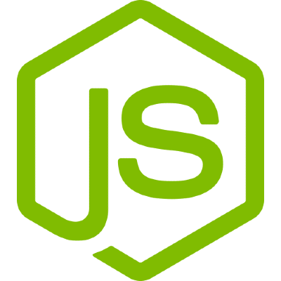
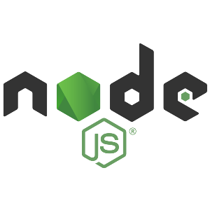
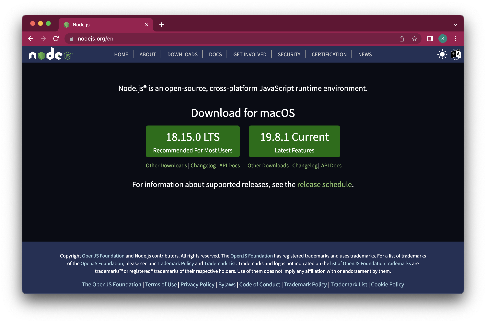
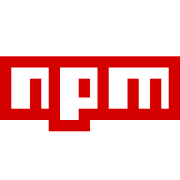

# 3️⃣ Frameworks en *JavaScript*

{align="right"}

En el desarrollo moderno de aplicaciones web, los `frameworks` de `JavaScript` para el frontend han transformado la manera en que se crean interfaces de usuario. En sus inicios, `JavaScript` se utilizaba principalmente para añadir interactividad básica a las páginas web mediante scripts independientes. Sin embargo, con el tiempo y el crecimiento exponencial de las aplicaciones web, surgió la necesidad de herramientas más estructuradas y eficientes para manejar el código, especialmente cuando las aplicaciones se volvieron más complejas, dinámicas y dependientes de la interacción en tiempo real.

### ¿Qué son los Frameworks de Frontend?

Un framework de frontend es un conjunto de herramientas, bibliotecas y convenciones que facilita la creación de aplicaciones web dinámicas.

Estos `frameworks` proporcionan una estructura base y abstraen muchas de las tareas complejas asociadas con la manipulación del DOM, la gestión de datos, la actualización de la interfaz de usuario y el manejo de eventos.

**En esencia**, permiten que los desarrolladores se concentren más en la lógica de la aplicación y menos en los detalles técnicos subyacentes.  

Los `frameworks` modernos de `JavaScript`, como **Vue.js**, **React** y **Angular**, están diseñados para manejar aplicaciones de una sola página (*Single Page Applications* o SPA), donde la mayor parte de la interacción ocurre en el navegador sin necesidad de recargar la página. Esto da lugar a experiencias más rápidas y fluidas para el usuario.


!!!danger "Cuidado..."
    No siempre es buena idea hacer una SPA, de la misma manera que tiene ventajas también tiene inconvenientes. Dependerá de las necesidades de nuestro proyecto si hacer una SPA o no, o utilizar herramientas adicionales para convertir una SPA en una aplicación web más avanzada.

### Ventajas de los Frameworks de Frontend  
1. **Modularidad:** Los `frameworks` permiten dividir la aplicación en componentes reutilizables. Cada componente encapsula su lógica, estilo y funcionalidad, lo que facilita la escalabilidad y el mantenimiento del código.  
2. **Gestión eficiente del DOM:** La manipulación directa del DOM puede ser ineficiente y propensa a errores. Los `frameworks` utilizan un *Virtual DOM* o técnicas similares para actualizar la interfaz de manera óptima.  
3. **Enlace de datos (*Data Binding*):** Simplifican la sincronización entre los datos de la aplicación y su representación visual en la interfaz.  
4. **Comunidad activa y ecosistema:** Los `frameworks` tienen una comunidad amplia que desarrolla bibliotecas, herramientas y documentación. Esto acelera el desarrollo y resuelve problemas comunes.  
5. **Compatibilidad con herramientas modernas:** La mayoría de los `frameworks` están diseñados para integrarse con sistemas de construcción (*build systems*), pruebas automatizadas y otras herramientas de desarrollo modernas.

## Preparando el entorno ➡ Instalando NodeJS

{align=right}

**`NodeJS`** es un entorno de ejecución de JavaScript del lado del servidor que permite a los desarrolladores ejecutar código JavaScript fuera del navegador. Fue creado en 2009 por **Ryan Dahl** y se basa en el motor **V8 de Google Chrome**, el cual es conocido por su alto rendimiento y eficiencia.

Antes de `NodeJS`, JavaScript estaba principalmente limitado a las aplicaciones del lado del cliente. Con `NodeJS`, se abrió la posibilidad de usar JavaScript para construir aplicaciones completas, desde el frontend hasta el backend, convirtiéndolo en una de las herramientas más populares en el desarrollo de software moderno.

!!!tip "¿Qué hace especial a `NodeJS`?"

1. **Modelo asíncrono y orientado a eventos**:  
   `NodeJS` adopta un modelo no bloqueante (non-blocking), lo que significa que puede manejar múltiples solicitudes al mismo tiempo sin necesidad de bloquear el flujo de ejecución. Esto lo hace extremadamente eficiente en aplicaciones de red o en escenarios donde se manejan grandes cantidades de datos.

2. **Plataforma multiplataforma**:  
   `NodeJS` se puede ejecutar en diversos sistemas operativos, como Windows, macOS y Linux, lo que lo convierte en una herramienta versátil.

3. **Único lenguaje para frontend y backend**:  
   Con `NodeJS`, los desarrolladores pueden escribir tanto la lógica del cliente como del servidor utilizando JavaScript, lo que reduce la curva de aprendizaje y fomenta la colaboración dentro de los equipos.

4. **Gran ecosistema de paquetes**:  
   `NodeJS` cuenta con **npm (Node Package Manager)**, un gestor de paquetes que alberga más de un millón de librerías. Estas librerías permiten a los desarrolladores integrar funcionalidades preconstruidas y acelerar el desarrollo de aplicaciones.

!!!note "Casos de uso de `NodeJS`"

`NodeJS` es ideal para ciertos tipos de aplicaciones, como:
- **Aplicaciones en tiempo real (Real-time Apps)**: chats, sistemas de mensajería, colaboración en línea.
- **APIs y servicios web**: construcción de RESTful APIs o GraphQL.
- **Aplicaciones de streaming**: transmisión de video o música en plataformas como Netflix.
- **Automatización de tareas**: scripts para compilación, pruebas o despliegue.

Sin embargo, no es la mejor opción para aplicaciones intensivas en CPU, como procesamiento complejo de datos, debido a su modelo de un solo hilo.

---

!!!danger "Ventajas de `NodeJS`"

1. **Eficiencia y rendimiento**:  
   Gracias al motor V8 y su arquitectura asíncrona, `NodeJS` puede manejar miles de conexiones simultáneas de manera eficiente.

2. **Escalabilidad**:  
   Es fácil escalar aplicaciones `NodeJS` horizontalmente (añadiendo más servidores) o verticalmente (aumentando los recursos del servidor).

3. **Comunidad activa**:  
   La comunidad de `NodeJS` es enorme y activa, lo que garantiza la disponibilidad de recursos, documentación y librerías.

4. **Rapidez en el desarrollo**:  
   Con herramientas como npm y la capacidad de usar el mismo lenguaje en el cliente y el servidor, `NodeJS` facilita la creación rápida de aplicaciones.

!!!warning "¿Por qué aprender `NodeJS`?"
    Aprender `NodeJS` es una excelente decisión para cualquier desarrollador web moderno, ya que:
    - Es uno de los entornos más demandados en el desarrollo backend.
    - Su simplicidad y eficiencia hacen que sea fácil de aprender y usar.
    - Es el corazón de muchas tecnologías modernas, como frameworks (Express.js, Nest.js) y herramientas de desarrollo (Webpack, Babel).

## Instalando NodeJS

Para poder Instalar `NodeJS` debemos dirigirnos a la web oficial y seleccionar el instalador correspondiente a nuestro sistema operativo.

Desde [este enlace a la web de NodeJS](https://nodejs.org/en/download/prebuilt-installer) podrás descargarte el paquete que necesitas.

!!!error "Cuidado con las versiones del instalador"
    Si no sabes de qué se trata, intenta SIEMPRE descargarte el paquete que diga LTS



## Introducción al gestor de paquetes NPM

{align="right"}

Ahora que ya tenemos listo el `NodeJS` podemos hacer uso de los repositorios de NPM

**NPM** (Node Package Manager) es el gestor de paquetes predeterminado para Node.js, y es una de las herramientas más importantes en el ecosistema de JavaScript. Fue lanzado en 2010 junto con Node.js para facilitar la instalación, gestión y distribución de librerías y paquetes de código reutilizable. Hoy en día, NPM es el repositorio de software más grande del mundo, con millones de paquetes disponibles para desarrolladores de todo el mundo.

### ¿Qué es un paquete en NPM?
Un **paquete** en NPM es un conjunto de archivos (normalmente JavaScript) que cumple una funcionalidad específica. Los paquetes pueden ser bibliotecas pequeñas que realizan tareas sencillas o frameworks completos para el desarrollo de aplicaciones. Por ejemplo:
- **Librerías**: `lodash` (utilidades para manipular datos), `moment` (manejo de fechas).
- **Frameworks**: `express` (framework backend), `react` (framework frontend).
- **Herramientas de desarrollo**: `webpack` (empaquetador), `eslint` (herramienta de linting).

### ¿Por qué es importante NPM?
NPM es fundamental para los desarrolladores porque:
1. **Facilita el acceso a librerías**: Permite instalar y utilizar fácilmente librerías creadas por otros desarrolladores.
2. **Gestiona dependencias**: Maneja automáticamente las dependencias que necesitan los proyectos.
3. **Promueve la colaboración y la reutilización**: Los desarrolladores pueden compartir sus propios paquetes con la comunidad.
4. **Optimiza el desarrollo**: Evita reinventar la rueda al permitir que los desarrolladores utilicen soluciones existentes para problemas comunes.

### Componentes de NPM

1. **El cliente de NPM (`npm`)**:  
   Es una herramienta de línea de comandos que viene preinstalada con Node.js. Permite instalar, actualizar, eliminar y gestionar paquetes.

2. **El registro de NPM**:  
   Es el repositorio en línea que almacena todos los paquetes disponibles. Puedes explorar estos paquetes en [npmjs.com](https://www.npmjs.com).

3. **El archivo `package.json`**:  
   Es un archivo clave en cualquier proyecto de Node.js. Contiene información sobre el proyecto, como su nombre, versión, dependencias y scripts. Por ejemplo:

   ```json
   {
     "name": "mi-proyecto",
     "version": "1.0.0",
     "description": "Un proyecto básico con Node.js y NPM",
     "dependencies": {
       "express": "^4.18.2"
     },
     "scripts": {
       "start": "node app.js"
     }
   }
   ```

   Este archivo ayuda a que otros desarrolladores puedan instalar las dependencias de tu proyecto con un solo comando (`npm install`).

---

### Comandos Básicos de NPM

1. **Instalar un paquete**:  
   ```bash
   npm install nombre-paquete
   ```
   Este comando descarga e instala un paquete del registro de NPM en la carpeta `node_modules`.

   Ejemplo:
   ```bash
   npm install express
   ```
   Esto instala el framework Express para construir servidores en Node.js.

2. **Instalar dependencias globales**:  
   ```bash
   npm install -g nombre-paquete
   ```
   Esto instala un paquete de forma global, permitiéndote usarlo en cualquier proyecto. Ejemplo: instalar el CLI de `nodemon`:
   ```bash
   npm install -g nodemon
   ```

3. **Crear un proyecto con `package.json`**:  
   Para inicializar un proyecto con un archivo `package.json`, se usa:
   ```bash
   npm init
   ```
   Este comando interactivo te guía para configurar tu proyecto.

4. **Actualizar un paquete**:  
   ```bash
   npm update nombre-paquete
   ```

5. **Eliminar un paquete**:  
   ```bash
   npm uninstall nombre-paquete
   ```

6. **Listar los paquetes instalados**:  
   ```bash
   npm list
   ```
   O, para ver los paquetes instalados globalmente:
   ```bash
   npm list -g
   ```
---

## Introducción a Vue.js

{align=right}

Vue.js es uno de los `frameworks` de `JavaScript` más populares, junto a React y Angular, en la actualidad, especialmente conocido por su facilidad de uso, flexibilidad y rendimiento.

Fue creado por `Evan You` en 2014 con el objetivo de ofrecer una herramienta más ligera y accesible en comparación con `frameworks` como Angular, pero con características potentes que lo hacen adecuado para proyectos tanto pequeños como grandes.

### Características principales de Vue.js

1. **Progresividad:** Vue está diseñado como un framework progresivo, lo que significa que puedes integrarlo gradualmente en un proyecto existente. Puedes empezar utilizando Vue simplemente para manejar una parte específica de tu aplicación y, si lo deseas, escalarlo para controlar toda la aplicación.  
2. **Sintaxis intuitiva:** La curva de aprendizaje de Vue es menos pronunciada que la de otros `frameworks`. Utiliza HTML y `JavaScript` extendidos con una sintaxis sencilla, lo que lo hace atractivo tanto para principiantes como para desarrolladores avanzados.  
3. **Componentes reutilizables:** Al igual que otros `frameworks` modernos, Vue permite estructurar la aplicación en componentes independientes que encapsulan su lógica, estilos y presentación.  
4. **Enlace bidireccional (*Two-Way Data Binding*):** Vue facilita la sincronización de los datos entre el modelo y la vista, lo que simplifica la actualización de la interfaz de usuario en tiempo real.  
5. **Virtual DOM:** Aunque Vue no fue el primero en introducir esta técnica, utiliza un DOM virtual para realizar actualizaciones rápidas y eficientes en la interfaz de usuario.  
6. **Ecosistema rico:** Con herramientas como Vue Router (para gestionar rutas) y Vuex (para la gestión del estado), Vue ofrece una solución integral para el desarrollo de aplicaciones modernas.

### ¿Por qué elegir Vue.js?

1. **Ligereza:** Vue es un framework ligero y rápido, lo que lo hace ideal para aplicaciones que priorizan el rendimiento.  
2. **Comunidad activa:** Aunque Vue no es tan masivo como React, su comunidad ha crecido considerablemente, proporcionando soporte, recursos y extensiones.  
3. **Flexibilidad:** Es adaptable tanto para proyectos pequeños como para aplicaciones web grandes y complejas.  
4. **Documentación excelente:** Vue es conocido por tener una de las documentaciones más claras y completas entre los `frameworks` de `JavaScript`.  

---