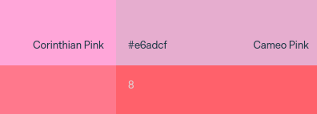
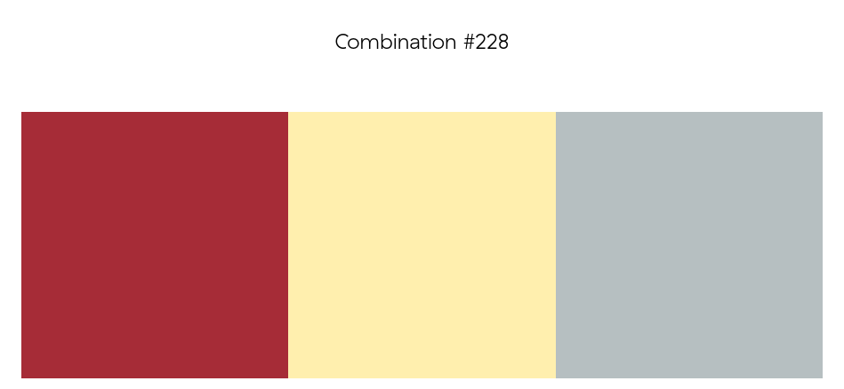
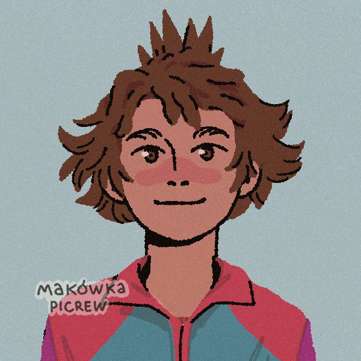

# 🍱 Movidas para desarrollar

{align="right"}

Nunca está de más motivarse a la hora de desarrollar aplicaciones o, en este caso, interfaces.

Además de la parte creativa que necesitamos para montar cualquier idea que tengamos en la cabeza, muchas veces no seguimos desarrollando puesto que nos faltan herramientas que facilitan nuestro trabajo.

Estas herramientas pueden ser desde entornos de desarrollo adecuados a nuestro gusto hasta software que nos facilite a sacar esa idea que tenemos dentro.

A continuación se muestra un listado de herramientas que podemos usar para desarrollar nuestras aplicaciones y que nuestra creatividad fluya sin barreras absurdas como   `es que no sé de dónde sacar una imagen de un mapache montado en un patinete`.

|||
|-|-|
|{width="200"}|[PNG Wing](https://www.pngwing.com/es){target="blank"} es un repositorios con imágenes PNG con transparencia de todo tipo donde puedes definir el ancho o el alto y se genera la imagen para descargar|
|{width="200"}|[Wada Sanzo - A Dictionary of Color Combinations](https://sanzo-wada.dmbk.io/){target="blank"} En esta web podemos seleccionar un color que nos guste y se mostrará en qué combinaciones de colores aparece en el diccionario de las combinaciones de color|
|{width="200"}|[A Dictionary of Color Combinationsby Sanzo Wada](https://colors.elwyn.co/){target="blank"} En esta versión del diccionario veremos las combinaciones directamente, pudiendo filtrar por combinaciones de 2, 3 y 4 colores, además nos da la opción de cambiar entre varios sitemas de nomenclatura del color 👉 RGB, HEX, CMYK y vec3|
|{width="200"}|[Makowka Picrew Maker II](https://picrew.me/en/image_maker/644129){target="blank"} Una herramienta online para crear tus avatares con un estilo de dibujo moderno pero que parece pintado a mano|