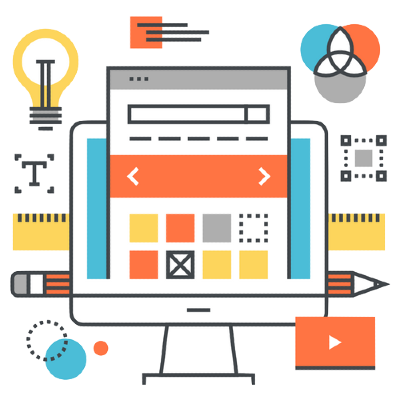

# Bienvenid@s a Diseño de Interfaces Web

{ align=right }

Bienvenidos a la asignatura de "Diseño de Interfaces Web" del Ciclo Superior de Desarrollo de Aplicaciones Web. En esta materia, exploraremos los principios fundamentales y las mejores prácticas para la creación de interfaces de usuario (UI) efectivas, intuitivas y estéticamente agradables. Aprenderemos cómo el diseño de interfaces no solo se enfoca en la apariencia visual, sino también en la experiencia de usuario (UX), buscando garantizar que las aplicaciones web sean fáciles de usar, accesibles y atractivas para los usuarios finales.

A lo largo del curso, abordaremos temas clave como la teoría del color, la tipografía, la disposición de elementos en pantalla (layout), la usabilidad, y la accesibilidad. También exploraremos las tendencias actuales en diseño web, las herramientas y tecnologías más utilizadas en la industria, y cómo implementar interfaces responsivas que se adapten a diferentes dispositivos y resoluciones de pantalla.

El objetivo de esta asignatura es que adquieras las competencias necesarias para diseñar interfaces de usuario que mejoren la interacción entre el usuario y las aplicaciones web, contribuyendo al éxito de los proyectos en los que participes.

Al finalizar el curso, serás capaz de crear prototipos de alta fidelidad y aplicar criterios de diseño que cumplan con las expectativas de los usuarios y los requisitos técnicos del desarrollo web moderno.

## Resultados de aprendizaje y criterios de evaluación

1. Planifica la creación de una interfaz web valorando y aplicando especificaciones de diseño.
      - Se ha reconocido la importancia de la comunicación visual y sus principios básicos.
      - Se han analizado y seleccionado los colores y tipografías adecuados para su visualización en pantalla.
      - Se han analizado alternativas para la presentación de la información en documentos web.
      - Se ha valorado la importancia de definir y aplicar la guía de estilo en el desarrollo de una aplicación web.
      - Se han utilizado y valorado distintas tecnologías para el diseño de documentos web.
      - Se han creado y utilizado plantillas de diseño.

2. Crea interfaces web homogéneos definiendo y aplicando estilos.

	- Se han reconocido las posibilidades de modificar las etiquetas HTML.
	- Se han definido estilos de forma directa.
	- Se han definido y asociado estilos globales en hojas externas.
	- Se han definido hojas de estilos alternativas.
	- Se han redefinido estilos.
	- Se han identificado las distintas propiedades de cada elemento.
	- Se han creado clases de estilos.
	- Se han utilizado herramientas de validación de hojas de estilos.
	- Se han analizado y utilizado tecnologías y frameworks para la creación de interfaces web con un diseño responsive.
	- Se han analizado y utilizado preprocesadores de estilos para traducir estilos comunes a un código estándar y reconocible por los navegadores.

3. Prepara archivos multimedia para la web, analizando sus características y manejando herramientas específicas.

	- Se han reconocido las implicaciones de las licencias y los derechos de autor en el uso de material multimedia.
	- Se han identificado los formatos de imagen, audio y vídeo a utilizar.
	- Se han analizado las herramientas disponibles para generar contenido multimedia.
	- Se han empleado herramientas para el tratamiento digital de la imagen.
	- Se han utilizado herramientas para manipular audio y vídeo.
	- Se han realizado animaciones a partir de imágenes fijas.
	- Se han importado y exportado imágenes, audio y vídeo en diversos formatos según su finalidad.
	- Se ha aplicado la guía de estilo.

4. Integra contenido multimedia en documentos web valorando su aportación y seleccionando adecuadamente los elementos interactivos.

	- Se han reconocido y analizado las tecnologías relacionadas con la inclusión de contenido multimedia e interactivo.
	- Se han identificado las necesidades específicas de configuración de los navegadores web para soportar contenido multimedia e interactivo.
	- Se han utilizado herramientas gráficas para el desarrollo de contenido multimedia interactivo.
	- Se ha analizado el código generado por las herramientas de desarrollo de contenido interactivo.
	- Se han agregado elementos multimedia a documentos web.
	- Se ha añadido interactividad a elementos de un documento web.
	- Se ha verificado el funcionamiento de los elementos multimedia e interactivos en distintos navegadores y dispositivos.

5. Desarrolla interfaces web accesibles, analizando las pautas establecidas y aplicando técnicas de verificación.

	- Se ha reconocido la necesidad de diseñar webs accesibles.
	- Se ha analizado la accesibilidad de diferentes documentos web.
	- Se han analizado los principios y pautas de accesibilidad al contenido, así como los niveles de conformidad.
	- Se han analizado los posibles errores según los puntos de verificación de prioridad.
	- Se ha alcanzado el nivel de conformidad deseado.
	- Se han verificado los niveles alcanzados mediante el uso de test externos.
	- Se ha verificado la visualización del interfaz con diferentes navegadores y tecnologías.
	- Se han analizado y utilizado herramientas y estrategias que mejoren la visibilidad y la accesibilidad de los sitios y páginas web en los resultados de los buscadores.

6. Desarrolla interfaces web amigables analizando y aplicando las pautas de usabilidad establecidas.

	- Se ha analizado la usabilidad de diferentes documentos web.
	- Se ha valorado la importancia del uso de estándares en la creación de documentos web.
	- Se ha modificado el interfaz web para adecuarlo al objetivo que persigue y a los usuarios a los que va dirigido.
	- Se ha verificado la facilidad de navegación de un documento web mediante distintos periféricos.
	- Se han analizado diferentes técnicas para verificar la usabilidad de un documento web.
	- Se ha verificado la usabilidad de la interfaz web creado en diferentes navegadores y tecnologías.

## 📖 Unidades didácticas

En función del tiempo disponible que tenemos, el temario se ha dividido de la siguiente manera

### Primera evaluación

	1️⃣ Fundamentos del Diseño de Interfaces Web  
	🗓️ 11 de septiembre - 25 de septiembre (2 semanas)

	✍️ Contenido

		- Importancia de la comunicación visual en el diseño web.
		- Principios básicos del diseño visual: balance, contraste, alineación y proximidad.
		- Selección y aplicación de colores y tipografías adecuadas para la web.
		- Presentación de la información en documentos web: buenas prácticas y técnicas.
		- Definición y aplicación de una guía de estilo.
		- Creación y utilización de plantillas de diseño.

	🎇 Objetivos

    	- Reconocer los principios de comunicación visual y aplicarlos
		  en la creación de interfaces coherentes y atractivas.

---

	2️⃣ Estilos y Diseño Responsive  
	🗓️ 26 de septiembre - 17 de octubre (3 semanas)

	✍️ Contenido

    	- Modificación de etiquetas HTML mediante CSS.
		- Definición de estilos directos y globales mediante hojas de estilos externas.
		- Creación y gestión de hojas de estilos alternativas y redefinición de estilos.
		- Propiedades de los elementos HTML y su aplicación en el diseño.
		- Creación de clases de estilos y validación de hojas de estilos.
		- Introducción a frameworks de diseño responsive (Bootstrap, Foundation).
		- Uso de preprocesadores de estilos (Sass, LESS) para optimizar el código CSS.

	🎇 Objetivos

    	- Crear interfaces web homogéneas y responsivas aplicando estilos mediante CSS y frameworks.

---

	3️⃣ Tratamiento y Preparación de Archivos Multimedia  
	🗓️ 18 de octubre - 7 de noviembre (3 semanas)

	✍️ Contenido

		- Derechos de autor y licencias en el uso de material multimedia.
		- Formatos de imagen, audio y vídeo adecuados para la web.
		- Herramientas para la generación y manipulación de contenido multimedia.
		- Tratamiento digital de imágenes: edición y optimización.
		- Manipulación de archivos de audio y vídeo: corte, edición y compresión.
		- Creación de animaciones a partir de imágenes fijas.
		- Importación y exportación de contenido multimedia en diversos formatos.

	🎇 Objetivos

    	- Preparar y optimizar archivos multimedia para su uso en la web,
		  respetando derechos de autor y licencias.

---

### Segunda evaluación

	4️⃣ Integración de Contenido Multimedia e Interactivo  
	🗓️ 8 de noviembre - 28 de noviembre (3 semanas)

	✍️ Contenido

		- Tecnologías para la inclusión de contenido multimedia e interactivo (HTML5, JavaScript).
		- Configuración de navegadores web para soportar contenido multimedia.
		- Uso de herramientas gráficas para el desarrollo de contenido interactivo.
		- Análisis y edición del código generado por herramientas de desarrollo.
		- Integración de multimedia en documentos web: imágenes, audio, vídeo.
		- Adición de interactividad en elementos web mediante JavaScript y CSS.
		- Verificación de la funcionalidad en distintos navegadores y dispositivos.

	🎇 Objetivos

    	- Integrar y optimizar contenido multimedia e interactivo en interfaces web,
		  asegurando su correcto funcionamiento.

---

	5️⃣ Accesibilidad en el Diseño de Interfaces Web  
	🗓️ 29 de noviembre - 19 de diciembre (3 semanas)

	✍️ Contenido

		- Importancia y necesidad de diseñar webs accesibles.
		- Principios y pautas de accesibilidad (WCAG).
		- Niveles de conformidad y puntos de verificación de accesibilidad.
		- Análisis de errores comunes y cómo solucionarlos.
		- Verificación de la accesibilidad mediante herramientas de testeo externas.
		- Estrategias para mejorar la visibilidad y accesibilidad en motores de búsqueda (SEO).

	🎇 Objetivos

    	- Desarrollar interfaces web accesibles cumpliendo con los estándares
		  y buenas prácticas de accesibilidad.

---

	6️⃣ Usabilidad en el Diseño de Interfaces Web  
	🗓️ 8 de enero - 28 de enero (3 semanas)

	✍️ Contenido

		- Análisis de la usabilidad en documentos web: principios y evaluación.
		- Importancia de los estándares en el diseño web.
		- Adecuación del interfaz web a los objetivos y usuarios específicos.
		- Verificación de la facilidad de navegación con distintos dispositivos.
		- Técnicas de testeo de usabilidad y su aplicación práctica.
		- Evaluación de la usabilidad en diferentes navegadores y tecnologías.

	🎇 Objetivos

    	- Diseñar interfaces web usables que faciliten la navegación y mejoren la experiencia del usuario.

---

	7️⃣ Proyecto Final de Diseño de Interfaces  
	🗓️ 29 de enero - 28 de febrero (5 semanas)

	✍️ Contenido

		- Planificación y desarrollo de un proyecto integral de diseño de interfaces web.
		- Aplicación de los conocimientos adquiridos en un proyecto real.
		- Presentación y defensa del proyecto final.
		- Evaluación y retroalimentación.

	🎇 Objetivos

    	- Consolidar los aprendizajes mediante la realización de un proyecto que integre
		  todos los elementos del diseño de interfaces web.

## 🎙️ Discord

Usaremos Discord como método de comunicación de información sobre la asignatura y este curso. Podéis hablar por el chat cuando queráis y usar los canales de estudio con audio por si queréis estudiar en un mismo sitio.

La invitación al canal es la siguiente ➡️ [https://discord.gg/C8yxabVTsS](https://discord.gg/C8yxabVTsS)